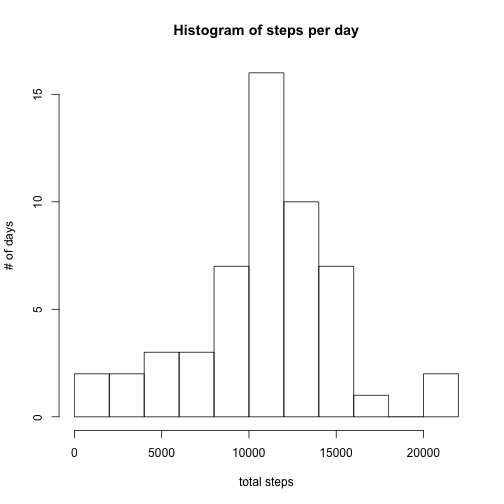
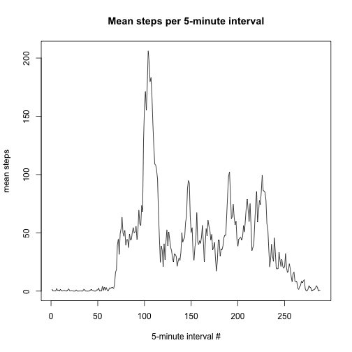
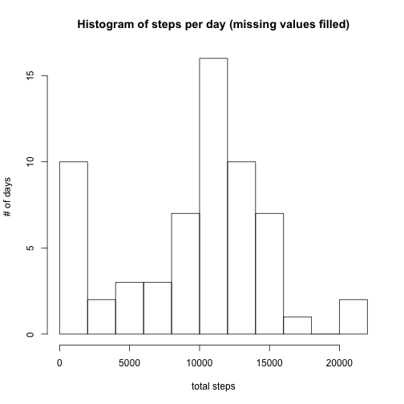
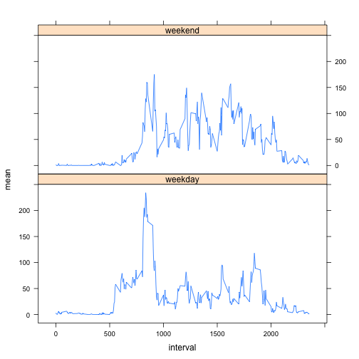

This experiment examines personal activity monitoring device data, with the aim to answer the following questions:

1. What is mean total number of steps taken per day?
2. What is the average daily activity pattern?
3. Are there differences in activity patterns between weekdays and weekends?

The experiment is done with [R programming language](https://www.r-project.org/) and it is part of Coursera course [Reproducible Research](https://class.coursera.org/repdata-032).

## Loading and preprocessing the data


```r
# Don't echo this, as this particular output provides nothing to the study
library(dplyr)
library(lattice)
```


```r
# Load the data if it doesn't exist yet
url <- "http://d396qusza40orc.cloudfront.net/repdata%2Fdata%2Factivity.zip"
if (!file.exists("activity.csv")) {
  temp <- tempfile()
  download.file(url, temp)
  unzip(temp)
  unlink(temp)
}

data <- read.csv("activity.csv")

# Create a subset of data with NA values removed
nasRemoved <- na.omit(data)
```

## What is mean total number of steps taken per day?


```r
means <- nasRemoved %>%
  group_by(date) %>%
  summarise(
    total = sum(steps)
)

meanSteps <- mean(means$total)
medianSteps <- median(means$total)

hist(means$total, breaks=10,
     main="Histogram of steps per day",
     ylab="# of days",
     xlab="total steps"
)
```

 

The mean total number of steps per day is 10766,
the median total number of steps is 10765.

## What is the average daily activity pattern?


```r
dailyPatterns <- nasRemoved %>%
  group_by(interval) %>%
  summarise(
    total = sum(steps),
    mean = mean(steps),
    variance = var(steps)
  )

highestIndex <- which.max(dailyPatterns$mean)
highestInterval <- dailyPatterns$interval[highestIndex]
highestIntervalHumanReadable <- paste(
  as.integer(highestInterval / 60), highestInterval %% 60, sep=":"
)
  
plot(dailyPatterns$mean, type="l",
     main="Mean steps per 5-minute interval",
     ylab="mean steps",
     xlab="5-minute interval #"
)
```

 

The highest activity 5-minute interval is 835
(13:55).

## Imputing missing values


```r
# Count the missing values
missingValueCount <- sum(is.na(data$steps))

# Fill in missing data by the mean of the corresponding 5-minute interval
fill = function(interval, steps) {
  value <- ifelse(
    is.na(steps),
    dailyPatterns[interval, ]$mean,
    steps
  )
}
filledData <- data %>%
  mutate(steps = fill(interval, steps))

# Calculate the impact
meansCorrected <- filledData %>%
  group_by(date) %>%
  summarise(
    total = sum(steps, na.rm = T)
  )

meanCorrectedSteps <- mean(meansCorrected$total)
medianCorrectedSteps <- median(meansCorrected$total)
meanStepsDiff <- sum(meansCorrected$total) - sum(means$total)

hist(meansCorrected$total, breaks=10,
     main="Histogram of steps per day (missing values filled)",
     ylab="# of days",
     xlab="total steps"
)
```

 

The number of values missing in the original data set is
2304. These were replaced with the mean of the corresponding
five minute interval within the whole data set. Note that despite the
additions, some NA values remain, as some intervals simply do not exist within
the whole data set.

After this correction, the mean total number of steps per day is
9545, the median total number of steps is
10395. The impact of filling in the missing
data is 11668 steps per day.

## Are there differences in activity patterns between weekdays and weekends?


```r
# Create a factor variable to denote whether the variable is weekday or
# weekend.
weekdaysData <- filledData %>%
  mutate(
    day = factor(
      ifelse(
        weekdays(as.POSIXct(date)) %in% c("Saturday","Sunday"),
        "weekend",
        "weekday"
        )
    ),
    interval = interval
  ) %>%
  group_by(interval, day) %>%
  summarise(
    total = sum(steps, na.rm=T),
    mean = mean(steps, na.rm=T),
    variance = var(steps, na.rm=T)
  )

xyplot(mean ~ interval | day,
       data=weekdaysData,
       layout=c(1,2,1),
       type = "l"
)
```

 

Based on the comparison between weekend and weekdays, it appears the test subjects are in generally more active over weekends, whereas during weekdays the activity is focused on relatively narrow interval (mornings) where the peak is higher than anywhere over weekend.
